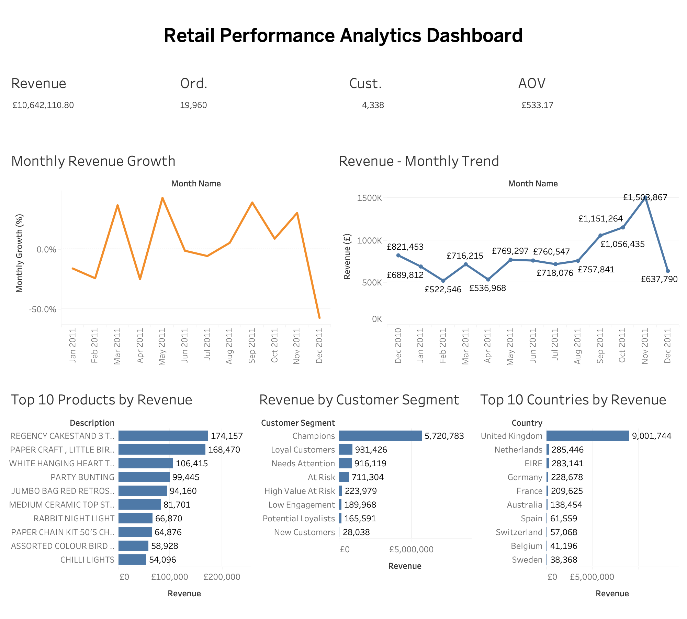

# Retail Performance Analytics

## Project Overview

This project analyses retail transaction data to evaluate overall sales performance, revenue trends, customer behaviour, product performance, and geographic performance.

The project combines data preparation, exploratory data analysis, SQL analysis, and Tableau dashboard development to transform raw retail transaction data into actionable business insights.

The final output is an executive-level Tableau dashboard supported by analytical documentation and visual reporting.

---

## Business Objective

The objective of this project is to answer key business questions around:

- Overall revenue and order performance
- Monthly revenue trends and growth
- Product-level revenue performance
- Customer segment contribution to revenue
- Country-level revenue performance
- Identification of high-performing and underperforming areas
- Opportunities for improving sales and customer engagement

---

## Key Performance Indicators

| KPI | Value |
|---|---:|
| Total Revenue | £10,642,110.80 |
| Total Orders | 19,960 |
| Unique Customers | 4,338 |
| Average Order Value | £533.17 |

---

## Key Insights

### Revenue Performance

The analysis generated total revenue of approximately £10.64 million across 19,960 orders, with an average order value of £533.17.

Revenue performance varies considerably across the analysis period, with noticeable monthly fluctuations and a strong increase toward the final quarter before a decline in December.

### Customer Segments

The Champions segment generated the largest contribution to revenue at approximately £5.72 million, substantially exceeding the other customer segments.

This indicates that a relatively small group of highly engaged customers contributes a significant proportion of overall revenue.

### Product Performance

Revenue is concentrated among several high-performing products. The leading product generated approximately £174,157 in revenue, followed by several products generating more than £90,000.

This provides an opportunity to identify products that contribute disproportionately to sales and evaluate whether similar products can be promoted or expanded.

### Geographic Performance

The United Kingdom generated approximately £9.00 million in revenue, making it by far the strongest market in the dataset.

The Netherlands, Ireland, Germany, and France were the next highest-revenue countries, although their contributions were substantially smaller than that of the United Kingdom.

---

## Dashboard

The Tableau Executive Dashboard provides a consolidated view of retail performance.

It includes:

- Revenue, Orders, Customers and AOV KPIs
- Monthly Revenue Growth
- Monthly Revenue Trend
- Top 10 Products by Revenue
- Revenue by Customer Segment
- Top 10 Countries by Revenue



---

## Tools & Technologies

- **Tableau** — Interactive dashboard development and business intelligence
- **SQL** — Data querying and analytical preparation
- **Python** — Data analysis and exploratory analysis
- **R** — Statistical analysis and exploratory data analysis
- **Excel/CSV** — Data handling and validation
- **Git/GitHub** — Version control and project documentation

---

## Project Structure

```text
retail-performance-analytics/
│
├── dashboard/
│   └── Retail_Performance_Analytics_Dashboard.twbx
│
├── data/
│   └── Raw and processed datasets
│
├── docs/
│   └── Supporting documentation
│
├── images/
│   └── Executive dashboard image
│
├── notebooks/
│   └── Analytical notebooks
│
├── presentation/
│   └── Project presentation
│
├── report/
│   └── Executive analytical report
│
├── sql/
│   └── SQL analysis scripts
│
├── src/
│   └── Source analysis scripts
│
├── visuals/
│   └── Supporting visualisations
│
├── LICENSE
├── README.md
└── requirements.txt


⸻

Analytical Approach

The project followed a structured analytical workflow:

1. Data preparation and validation
2. Data cleaning and transformation
3. Exploratory data analysis
4. SQL-based analysis
5. KPI development
6. Product, customer and geographic analysis
7. Tableau dashboard development
8. Executive reporting
9. Insight generation and recommendations

⸻

Deliverables

The project produces the following key deliverables:

* Tableau Executive Dashboard
* Executive Analytical Report
* SQL Analysis
* Python/R Analytical Work
* Supporting Visualisations
* Project Documentation
* Presentation

⸻

Recommendations

Based on the analysis, the business should:

1. Prioritise retention and engagement strategies for high-value customers, particularly Champions.
2. Investigate the characteristics of top-performing products and assess opportunities to increase sales of similar products.
3. Protect and strengthen the UK market while evaluating opportunities for growth in other high-potential markets.
4. Investigate significant monthly revenue fluctuations to understand the underlying drivers of peaks and declines.
5. Use customer segmentation to develop differentiated marketing and retention strategies.

⸻

Author

Ekab-Osowo Tawo

MSc Data Science | Data Analyst

⁠LinkedIn 

⁠GitHub